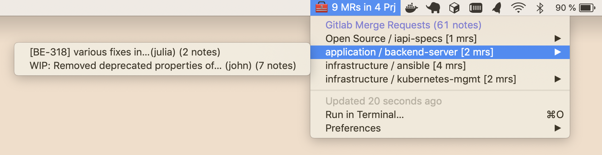

# Gitlab MR plugin for Bitbar

This script will check your Gitlab installation for outstanding merge requests and show it in the Menubar of MacOS.



## Installation

1. Download [Bitbar](https://getbitbar.com/)
2. Put `gitlab_mrs.3m.py` script in your bitbar plugins folder (usually `~/.bitbar`). It will reload every 3 minutes - but you can adjust the frequency to your needs.
3. Configure the plugin config (`~/.gitlab_mrs`) with your instance details (plugin will create a template on first launch):

```
{
    "gitlab_host": "your.gitlab.host",
    "gitlab_token": "PRIVATE_TOKEN"
}
```